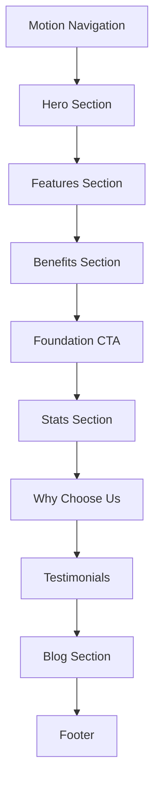

# Staco - Financial Solutions Platform

A modern, animated financial solutions landing page built with Nuxt 4 and Vue 3. Empowering businesses with smart financial management tools through a beautiful, responsive user interface.

<p align="center">
  
</p>


## 🔗 Demo Link

- **Live Demo:** 
- **GitHub Repository:** 

---

## ✨ Features

### Core Functionality

- **Financial Solutions Showcase** - Present comprehensive financial management services
- **Animated Hero Section** - Eye-catching video background with rotating text animations
- **Multi-Section Layout** - Complete landing page with features, benefits, stats, and testimonials
- **Blog Integration** - Latest insights and financial news section
- **Call-to-Action Sections** - Strategic CTAs for user engagement

### User Experience

- **Motion Animations** - Smooth scroll-triggered animations powered by VueUse Motion
- **Modern Navigation** - Pill-shaped motion tabs with sleek indicator effects
- **Loading Screen** - Elegant loading experience on initial page load
- **Scroll Progress** - Visual scroll progress indicator
- **Responsive Design** - Fully optimized for mobile, tablet, and desktop
- **Video Controls** - Interactive video player with play/pause functionality

### Design Highlights

- **Glassmorphism Effects** - Modern glass-blur styling
- **Floating Animations** - Subtle floating decorative elements
- **Gradient Overlays** - Beautiful gradient backgrounds and text effects
- **Custom Typography** - Plus Jakarta Sans & DM Sans font pairing

## 🛠️ Tech Stack

| Technology         | Purpose                         |
| ------------------ | ------------------------------- |
| **Nuxt 4**         | Vue framework with App Router   |
| **Vue 3**          | UI library with Composition API |
| **TypeScript**     | Type safety                     |
| **Tailwind CSS 4** | Utility-first styling           |
| **Nuxt UI**        | Accessible UI components        |
| **VueUse Motion**  | Animation library               |
| **Lucide Icons**   | Icon library (via Nuxt UI)      |

## 📁 Project Structure

```
├── app/
│   ├── app.vue              # Root Vue application
│   ├── assets/
│   │   └── css/
│   │       └── main.css     # Global styles, fonts & animations
│   ├── components/
│   │   ├── MotionNav.vue           # Animated navigation bar
│   │   ├── HeroSection.vue         # Hero with video & rotating text
│   │   ├── FeaturesSection.vue     # Feature cards grid
│   │   ├── BenefitsSection.vue     # Benefits showcase
│   │   ├── FoundationCTA.vue       # Call-to-action card
│   │   ├── StatsSection.vue        # Statistics display
│   │   ├── WhyChooseUs.vue         # Value propositions
│   │   ├── TestimonialsSection.vue # Customer testimonials
│   │   ├── BlogSection.vue         # Blog posts grid
│   │   ├── CTASection.vue          # Secondary CTA section
│   │   ├── FooterSection.vue       # Site footer
│   │   ├── LoadingScreen.vue       # Initial loading animation
│   │   └── ScrollProgress.vue      # Scroll progress indicator
│   └── pages/
│       └── index.vue        # Main landing page
├── public/
│   ├── logo.svg             # Brand logo
│   ├── favicon.svg          # Site favicon
│   ├── Staco - Finance.mp4  # Hero video
│   └── ...                  # Images & icons
├── nuxt.config.ts           # Nuxt configuration with SEO
└── package.json             # Project dependencies
```

---

## 🚀 Getting Started

### Prerequisites

- Node.js 18+
- npm, yarn, pnpm, or bun

### Installation

1. **Clone the repository**

   ```bash
   git clone https://github.com/your-username/staco.git
   cd staco
   ```

2. **Install dependencies**

   ```bash
   npm install
   # or
   pnpm install
   # or
   yarn install
   # or
   bun install
   ```

3. **Run the development server**

   ```bash
   npm run dev
   ```

4. **Open in browser**
   ```
   http://localhost:3000
   ```

---

## 📜 Available Scripts

| Command            | Description              |
| ------------------ | ------------------------ |
| `npm run dev`      | Start development server |
| `npm run build`    | Build for production     |
| `npm run generate` | Generate static site     |
| `npm run preview`  | Preview production build |

---

## 🔄 Page Sections Flow



### Navigation

- Pill-shaped motion tabs with smooth indicator
- Responsive mobile menu
- Scroll-aware styling

### Hero Section

- Rotating word animations (Easier, Accountable, Unbeatable)
- Embedded video with custom play/pause controls
- Decorative leaf SVG elements
- Call-to-action buttons

### Features Section

- Three-column card grid
- Hover animations with icon transitions
- Technology, Typography, and Support highlights

### Stats Section

- Animated counters
- Global map visualization
- Key business metrics

### Testimonials

- Customer reviews carousel
- Company logos
- Rating displays

---

## 🎨 Design System

### Colors

| Color          | Hex       | Usage                  |
| -------------- | --------- | ---------------------- |
| Primary        | `#10B981` | Buttons, highlights    |
| Primary Dark   | `#059669` | Hover states           |
| Accent Green   | `#44C486` | CTA buttons, icons     |
| Light Green    | `#B2EDA1` | Hover effects, accents |
| Dark Blue      | `#1F2334` | Hero background        |
| Text Dark      | `#0F172A` | Headings               |
| Text Secondary | `#64748B` | Body text              |
| Card BG        | `#ECEFF1` | Card backgrounds       |

### Typography

- **Plus Jakarta Sans** - Headings, navigation (700-800 weight)
- **DM Sans** - Body text, buttons (400-600 weight)

### Components

- Pill-shaped buttons with full border-radius
- Rounded cards with subtle shadows
- Glass-morphism navigation effects
- Hover lift animations (-translate-y)

---

## 🔧 Configuration

### SEO (nuxt.config.ts)

The project includes comprehensive SEO configuration:

- Meta title and description
- Open Graph tags
- Twitter Card support
- Custom favicon

### Modules

```typescript
modules: ["@nuxt/ui", "@vueuse/motion/nuxt"];
```

---

## 💭 Design Decisions

| Decision              | Rationale                                                      |
| --------------------- | -------------------------------------------------------------- |
| **Nuxt 4**            | Latest framework with improved performance and App Router      |
| **VueUse Motion**     | Declarative animations with excellent Nuxt integration         |
| **Nuxt UI**           | Pre-built accessible components with Tailwind CSS integration  |
| **Component-based**   | Each section is a standalone component for maintainability     |
| **Motion Navigation** | Unique pill-shaped nav with sliding indicator for premium feel |
| **Video Hero**        | Engaging visual element to capture user attention              |

---

## 📱 Responsive Breakpoints

| Breakpoint | Width    | Changes                             |
| ---------- | -------- | ----------------------------------- |
| Mobile     | < 768px  | Stacked layouts, smaller typography |
| Tablet     | ≥ 768px  | Two-column grids, medium spacing    |
| Desktop    | ≥ 1024px | Full layouts, maximum spacing       |

---


<p align="center">
  Made for sycamore stage 2 assessment using Nuxt 4 & Vue 3
</p>
